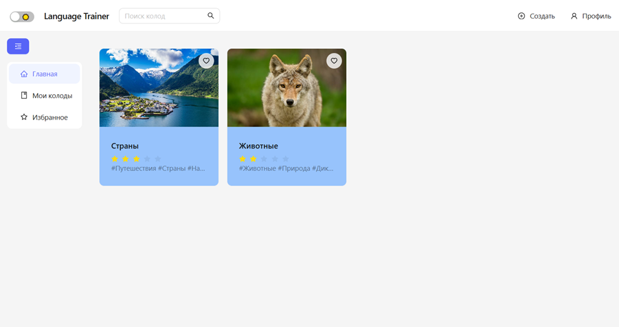
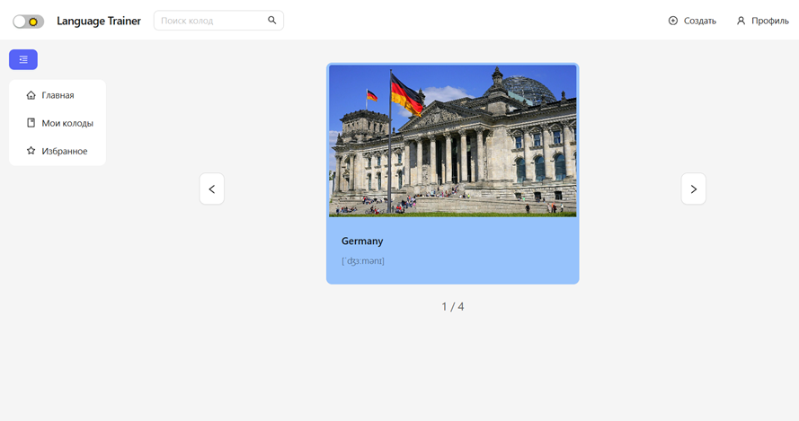
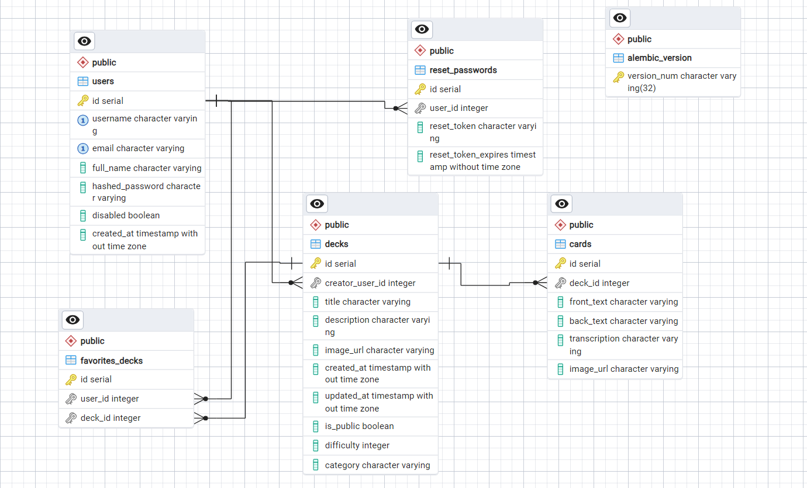

# Foreign Language Trainer

A full-stack web application designed to help users learn and practice vocabulary through structured flashcard decks. The platform allows learners to create their own study sets, browse public decks, save favorites, search for relevant content, and continue improving language skills in a simple and efficient workflow.

## Overview

Foreign Language Trainer is a modern learning platform for people who want to study vocabulary in a more structured and engaging way. It combines the power of a REST API backend with a user-friendly React frontend, allowing users to manage educational content, keep their personal study collections, and revisit favorite material whenever needed.

The app is built for language learners who want a practical and personalized method to memorize words, phrases, and expressions while tracking what they study most often.

## Why this project exists

Learning a foreign language is easier when the material is organized, visible, and easy to revisit. This project was created to provide a lightweight educational tool that helps users:

- build custom vocabulary decks;
- organize cards by topic or category;
- find public deck collections quickly;
- save useful decks to a favorites list;
- study from their own and shared content;
- maintain a smoother learning routine with a clear interface.

## Who is this project for?

This project is intended for:

- language learners who want a personal vocabulary system;
- students preparing for exams, speaking practice, or reading tasks;
- self-learners looking for a simple and modern study tool;
- teachers or tutors who want to create and share structured learning resources;
- anyone who prefers card-based memorization as a daily practice method.

## Key features

- User authentication and account access;
- Password recovery and reset flow;
- Create, update, and manage custom decks;
- Add cards with learning content to a deck;
- Browse public decks and user-created collections;
- Search decks by name or category;
- Save decks to favorites for quick access;
- View personal decks in a dedicated section;
- Switch between light and dark themes;
- Responsive and clean interface built with React and Ant Design.

## Screenshots

### Interface preview 1



### Interface preview 2



## Tech stack

### Frontend

- React
- TypeScript
- Ant Design
- React Router
- Axios

### Backend

- FastAPI
- SQLAlchemy
- PostgreSQL
- Redis
- JWT authentication
- Pydantic

## Project architecture

The application follows a typical full-stack architecture:

- Frontend provides the user interface and interaction layer.
- Backend exposes API endpoints for authentication, deck management, favorites, and search.
- PostgreSQL stores the persisted application data.
- Redis is used for caching favorite deck information to improve response speed.

## Database schema



## Getting started

### 1. Clone the repository

```bash
git clone https://github.com/LomakinVladislav/foreign-language-trainer.git
cd foreign-language-trainer
```

### 2. Backend setup

Go to the backend folder:

```bash
cd backend
```

Create virtual environment:

```bash
python -m venv venv
```

Activate the virtual environment:

```bash
.\venv\Scripts\activate
```

Install dependencies:

```bash
pip install -r requirements.txt
```

Start the backend server:

```bash
python .\src\main.py
```

> The backend application runs with FastAPI and starts on the local server configured in the project.

### 3. Frontend setup

Go to the frontend folder:

```bash
cd frontend
```

Install dependencies:

```bash
npm install
```

Run the application:

```bash
npm start
```

This will launch the React frontend in development mode.

## Project structure

```text
foreign-language-trainer/
├── backend/
│   ├── src/
│   ├── configs/
│   ├── requirements.txt
│   └── alembic.ini
├── frontend/
│   ├── src/
│   ├── public/
│   └── package.json
├── readme_pictures/
├── README.md
└── .gitignore
```

## Features in practice

Users can:

- create their own flashcard decks for specific learning goals;
- organize content based on language topics;
- keep the most useful decks in favorites;
- search through the collection in seconds;
- restore lost passwords using a secure recovery flow;
- switch between different visual themes depending on personal preference.

## Contribution

Contributions are welcome. If you want to improve the project, add features, fix bugs, or improve the UI, feel free to open a pull request or suggest changes.

## Author

Author: Lomakin Vladislav

GitHub: https://github.com/LomakinVladislav

## License

This project is intended for educational and personal use. Please refer to the repository owner for additional licensing details if needed.
